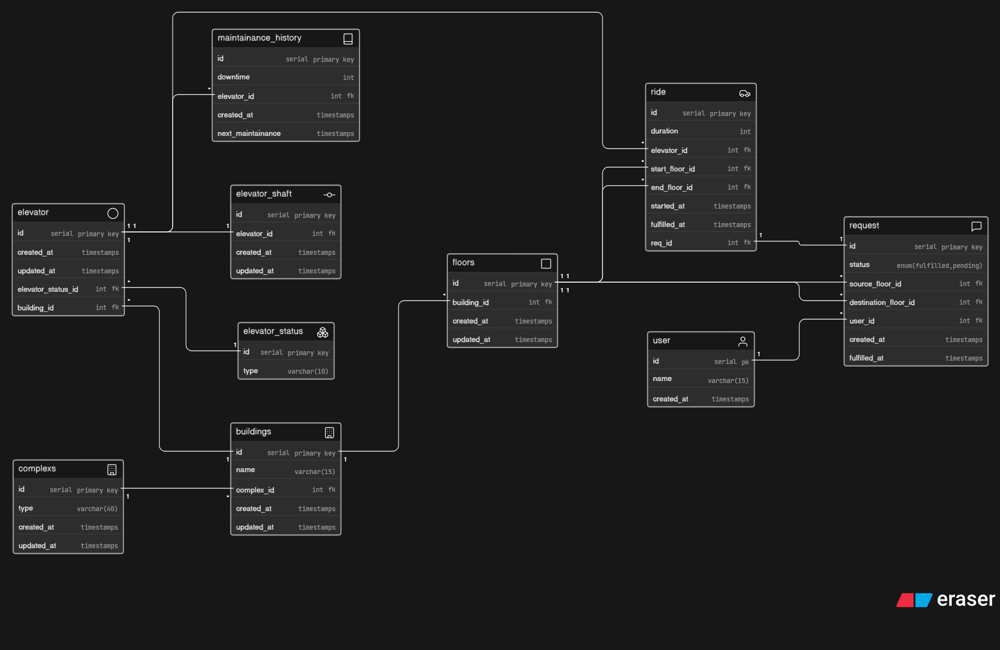

# 🚀 Smart Elevator Control System – ER Diagram

## 📌 Overview

This project represents the **database design (ER Diagram)** for a smart elevator control platform used in large-scale infrastructures like corporate buildings, malls, hospitals, and residential complexes.

The system is designed to efficiently manage:

* Multiple buildings and complexes
* Elevator operations across floors
* Ride requests and allocations
* Maintenance tracking
* Usage analytics

---

## 🏗️ System Architecture

The platform models a **multi-building environment** where:

* A **complex** contains multiple buildings
* Each **building** has multiple floors and elevators
* **Elevators** serve multiple floors
* **Users** generate ride requests
* Requests are assigned to elevators as rides
* Maintenance and status tracking are handled separately

---

## 🧩 Entities & Relationships

### 1. Complexes

* Represents a group of buildings
* One-to-many relationship with buildings

### 2. Buildings

* Belong to a complex
* Contain multiple floors and elevators

### 3. Floors

* Belong to a building
* Used as source/destination for requests and rides

### 4. Elevators

* Belong to a building
* Track current operational status
* Serve multiple rides

### 5. Elevator Status

* Stores status types like `idle`, `moving`, `maintenance`
* Linked to elevators

### 6. Requests

* Generated by users
* Contains:

  * source floor
  * destination floor
  * status (pending/fulfilled)

### 7. Rides

* Created when a request is assigned to an elevator
* Tracks:

  * elevator handling the ride
  * start and end floors
  * timestamps and duration

### 8. Users

* Generate elevator requests

### 9. Maintenance History

* Tracks downtime and maintenance schedules per elevator

### 10. Elevator Shaft (Optional)

* Represents physical shaft assignment for elevators

---

## 📊 Questions This Design Can Answer

* How many elevators exist in a building?
* Which requests are still pending?
* Which elevator handled the most rides?
* How many rides were completed today?
* Which floors are most frequently used?
* What is the maintenance history of an elevator?

---

## 🖼️ ER Diagram

## 👨‍💻 Author

**Hrishikesh Shanbhag**
